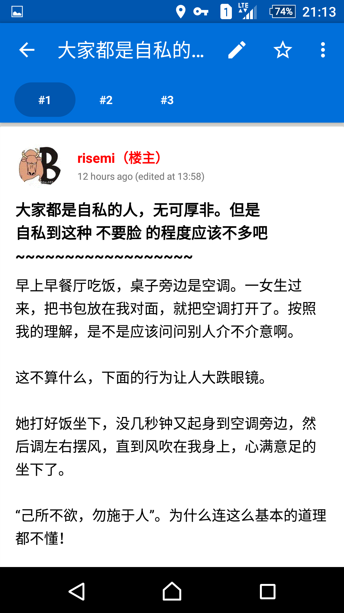
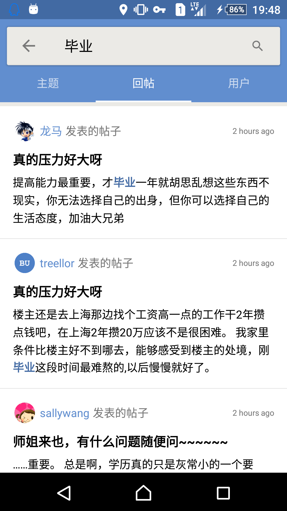
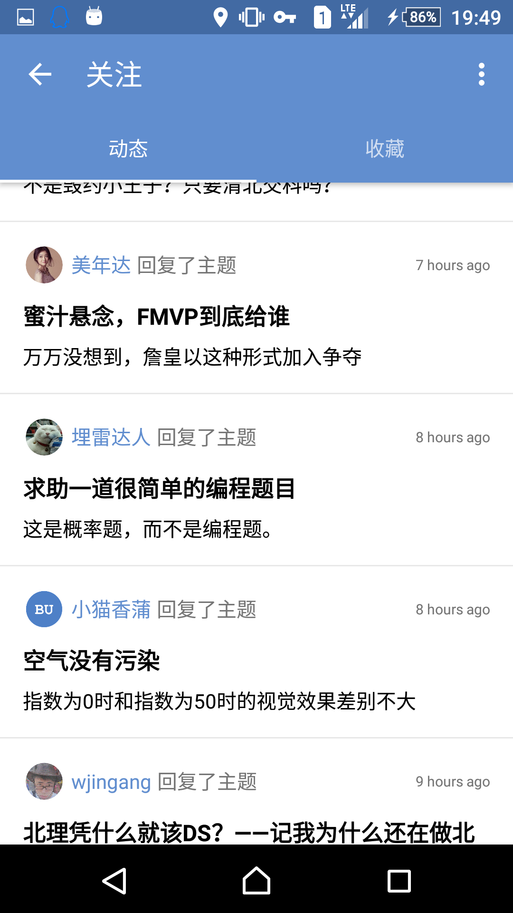

# BITUnion Android Client (Unofficial)

An unofficial BITUnion client for Android based on [BITUnion Open API Project](http://out.bitunion.org/thread-10471436-1-1.html).

## APK Download

[Click Me](http://pan.baidu.com/s/1eRfU6qe)

## Features
- 不算太丑的界面
- 登录与登出，自动更新过期 Session
- 查看用户资料，包括基本信息和用户最新动态（发帖、回帖、关注、收藏）
- 查看论坛板块列表，自动记录最常访问板块
- 查看首页最新回复帖子列表和板块内主题列表
- 阅读帖子内容，支持分页浏览和跳楼，可调整帖子内部正文字体大小与行间距
- 图片查看和保存，附件查看和下载
- 发布与回复主题，可插入表情，可引用回复，可上传附件，支持大尺寸图片附件自动压缩，支持发帖预览
- 主题收藏和查看
- 可关注用户并查看所有关注用户的最新动态，可管理关注列表
- 主题被回复、帖子被引用、被 @ 等情况下的系统通知提醒
- 减少用户所消耗的数据流量，支持图片缓存，提供仅 Wi-Fi 下自动下载图片选项
- 调试模式
- 主题 / 回帖搜索
- 自动 / 手动版本更新 
- 更多细节等待你的发现 :D

## Screenshots

#### 首页

#### 回帖列表

#### 搜索页面

#### 关注页面

## Known issues
- 联盟限制导致某些动态链接的附件无法正常获取；
- 不支持动态图片显示；
- 界面偶尔会出现显示异常。

## Todo
- [ ] 支持板块内搜索和个人搜索
- [ ] 模糊搜索
- [ ] 修复多 Fragments 切换导致界面异常的 Bug
- [ ] 消息盒子
- [ ] 界面美化，提供主题选择功能 

## Thanks
- [Wuhao Ouyang](https://github.com/wuhao-ouyang)
- [BITUnion Open API Project](http://out.bitunion.org/thread-10471436-1-1.html).
- [我要毕业](http://out.bitunion.org/profile-uid-134574.html)