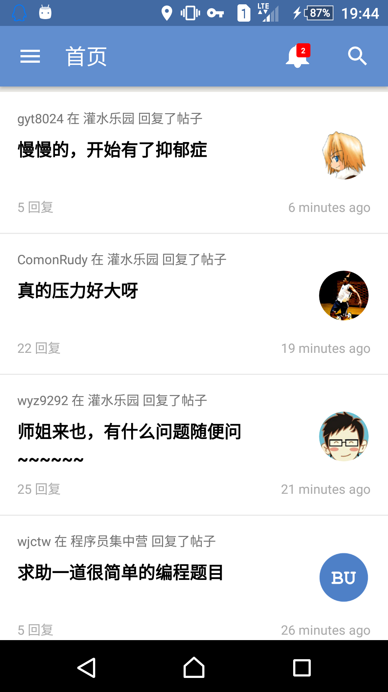
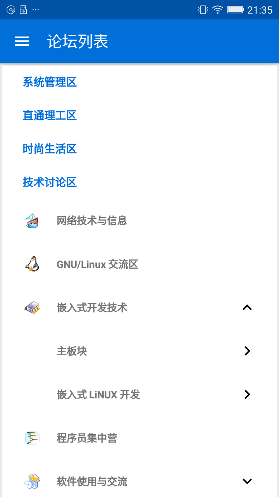
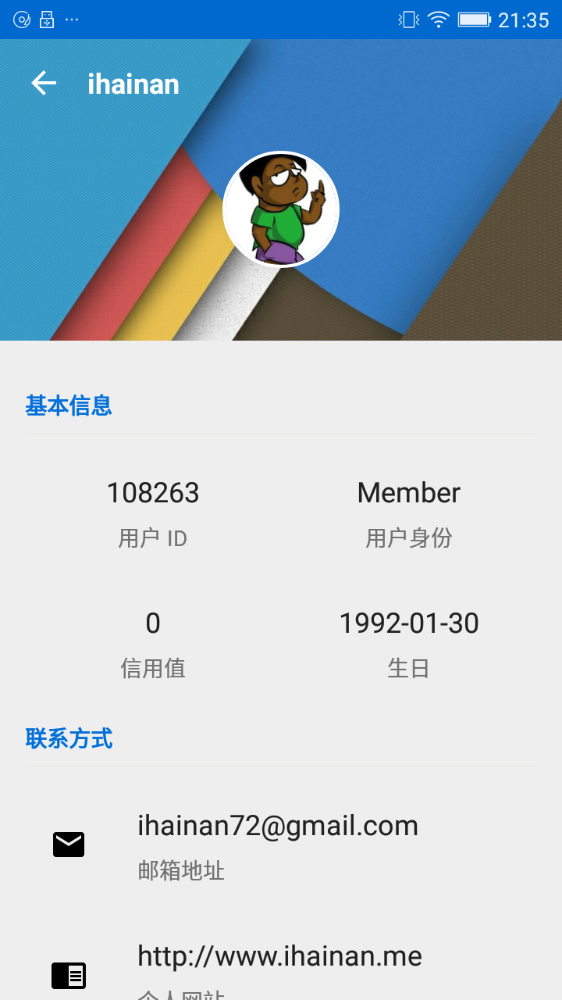
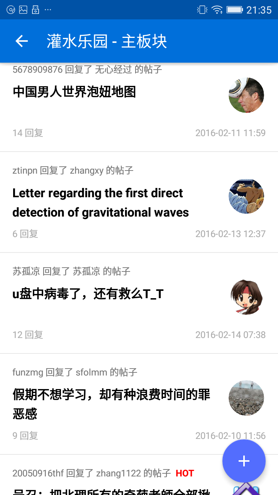
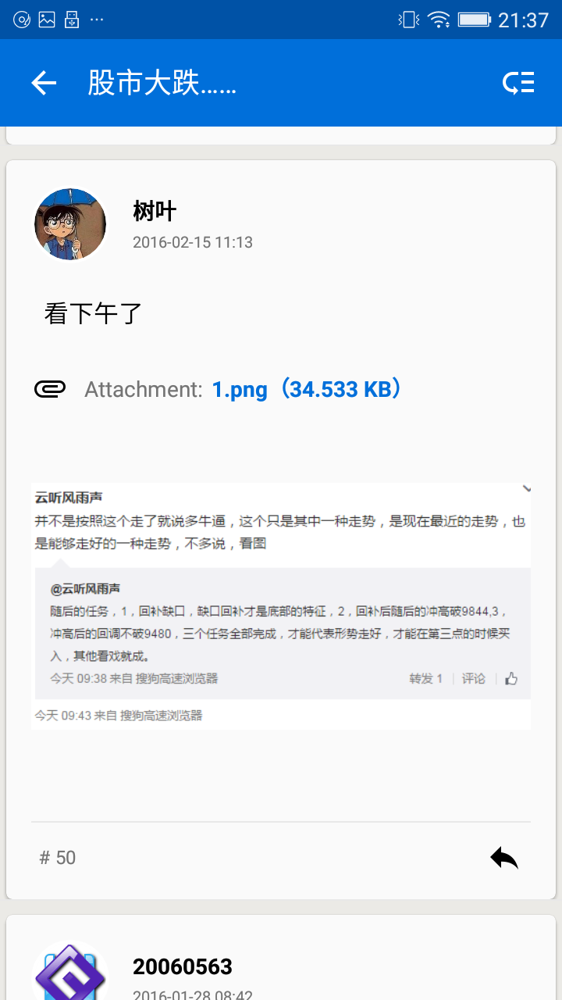

# BITUnion Android Client (Unofficial)

An unofficial BITUnion client for Android based on [BITUnion Open API Project](http://out.bitunion.org/thread-10471436-1-1.html).

## APK Download

[Click Me](http://pan.baidu.com/s/1eRfU6qe)

## Features
- 登录与登出
- 用户资料查看
- 首页帖子列表查看
- 论坛组、主论坛、子论坛列表查看
- 论坛帖子列表
- 帖子内容阅读
- 帖子附件查看和下载
- 用户资料与图片缓存机制
- __当前版本暂不包含发帖和回帖功能__

## Screenshots

#### 首页

#### 论坛列表

#### 用户资料

#### 帖子列表

#### 帖子内容

## Known issues
- 联盟的限制导致某些图片和附件无法获取；
- RecyclerView 中的 WebView 导致回帖列表有时候不能平滑滑动。

## Todo
- [ ] 发帖、回帖功能
- [ ] 设置页面
- [ ] 帖子收藏
- [ ] 论坛收藏
- [ ] 热门帖子
- [ ] 服务器端程序监控联盟新帖
- [ ] 图片查看
- [ ] 记录上一次浏览位置
- [ ] WebView 优化
- [ ] 浏览器 Cookie & Session 来获取某些图片和附件

## Thanks
- [Wuhao Ouyang](https://github.com/wuhao-ouyang)
- [BITUnion Open API Project](http://out.bitunion.org/thread-10471436-1-1.html).

